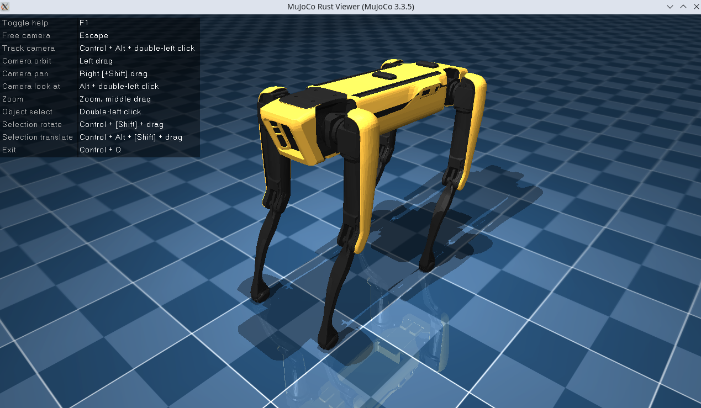

# MuJoCo-rs
[](https://docs.rs/mujoco-rs)
[](https://crates.io/crates/mujoco-rs)

[](https://mujoco-rs.readthedocs.io/en/stable/)

MuJoCo bindings and high-level wrappers for the Rust programming language. Includes a Rust-native viewer and also
bindings to a modified C++ one.

[MuJoCo](https://mujoco.org/) is a general purpose physics simulator.


## Documentation
More detailed documentation is available at the:
- [**API docs**](https://docs.rs/mujoco-rs)
- [**Guide book**](https://mujoco-rs.readthedocs.io/en/stable/)

## MuJoCo version
This library uses FFI bindings to MuJoCo **3.3.7**.

## Installation
For installation, see the [**guide book**](https://mujoco-rs.readthedocs.io/en/stable/installation.html).

## Main features
MuJoCo-rs tries to stay close to the MuJoCo's C API, with a few additional features for ease of use.
The main features on top of MuJoCo include

- Safe wrappers around structs:
  
  - Automatic allocation and cleanup.
  - Lifetime guarantees.

- Methods as function wrappers.
- Easy manipulation of simulation data via attribute views.
- High-level model editing.
- Visualization:

  - Renderer: offscreen rendering to array or file.
  - Viewer: onscreen visualization of the 3D simulation.


## Rust-native viewer
Screenshot of the built-in Rust viewer. Showing scene from [MuJoCo's menagerie](https://github.com/google-deepmind/mujoco_menagerie/tree/main/boston_dynamics_spot).



## Optional Cargo features
Optional Cargo features can be enabled:

- ``viewer``: enables the Rust-native MuJoCo viewer.

  - ``viewer-ui``: enables the (additional) user UI within the viewer.

- ``cpp-viewer``: enables the Rust wrapper around the C++ MuJoCo viewer.
  This requires static linking to a modified fork of MuJoCo, as described in [installation](https://mujoco-rs.readthedocs.io/en/latest/installation.html#static-linking).
- ``renderer``: enables offscreen rendering for writing RGB and
  depth data to memory or file.

  - ``renderer-winit-fallback``: enables the invisible window fallback (based on winit) when offscreen
    rendering fails to initialize. Note that true offscreen rendering is only available on Linux platforms
    when the video driver supports it. On Windows and MacOS, this feature must always be
    enabled when the ``renderer`` feature is enabled.

- ``auto-download-mujoco``: MuJoCo dependency will be automatically downloaded to the specified path.

  - This is only available on Linux and Windows.

By default, ``viewer``, ``viewer-ui`` and ``renderer`` are enabled.


## Example
This example shows how to launch the viewer and print the coordinates
of a moving ball to the terminal.
Other examples can be found under the ``examples/`` directory.

```rust
//! Example of using views.
//! The example shows how to obtain a [`MjJointInfo`] struct that can be used
//! to create a (temporary) [`MjJointView`] to corresponding fields in [`MjData`].
use std::time::Duration;

use mujoco_rs::viewer::MjViewer;
use mujoco_rs::prelude::*;


const EXAMPLE_MODEL: &str = "
<mujoco>
  <worldbody>
    <light ambient=\"0.2 0.2 0.2\"/>
    <body name=\"ball\">
        <geom name=\"green_sphere\" size=\".1\" rgba=\"0 1 0 1\" solref=\"0.004 1.0\"/>
        <joint name=\"ball_joint\" type=\"free\"/>
    </body>

    <geom name=\"floor1\" type=\"plane\" size=\"10 10 1\" euler=\"15 4 0\" solref=\"0.004 1.0\"/>
    <geom name=\"floor2\" type=\"plane\" pos=\"15 -20 0\" size=\"10 10 1\" euler=\"-15 -4 0\" solref=\"0.004 1.0\"/>

  </worldbody>
</mujoco>
";

fn main() {
    /* Load the model and create data */
    let model = MjModel::from_xml_string(EXAMPLE_MODEL).expect("could not load the model");
    let mut data = model.make_data();  // or MjData::new(&model);

    /* Launch a passive Rust-native viewer */
    let mut viewer = MjViewer::launch_passive(&model, 0)
        .expect("could not launch the viewer");

    /* Create the joint info */
    let ball_info = data.joint("ball_joint").unwrap();

    /* Obtain the timestep through the wrapped mjModel */
    let timestep = model.opt().timestep;

    while viewer.running() {
        /* Step the simulation and sync the viewer */
        viewer.sync(&mut data);
        data.step();

        /* Obtain the view and access first three variables of `qpos` (x, y, z) */
        let xyz = &ball_info.view(&data).qpos[..3];
        println!("The ball's position is: {xyz:.2?}");

        std::thread::sleep(Duration::from_secs_f64(timestep));
    }
}
```
